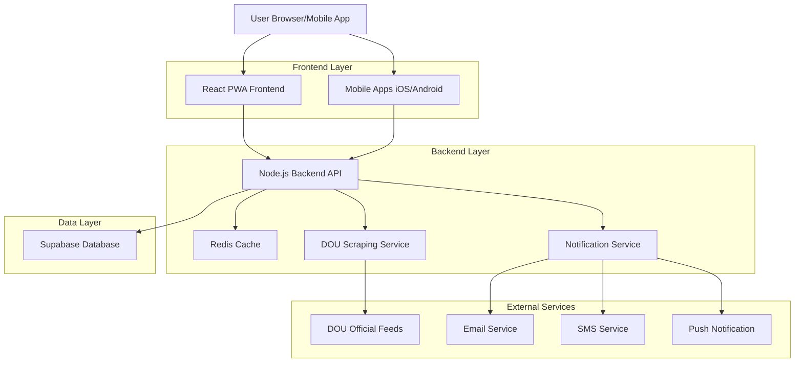
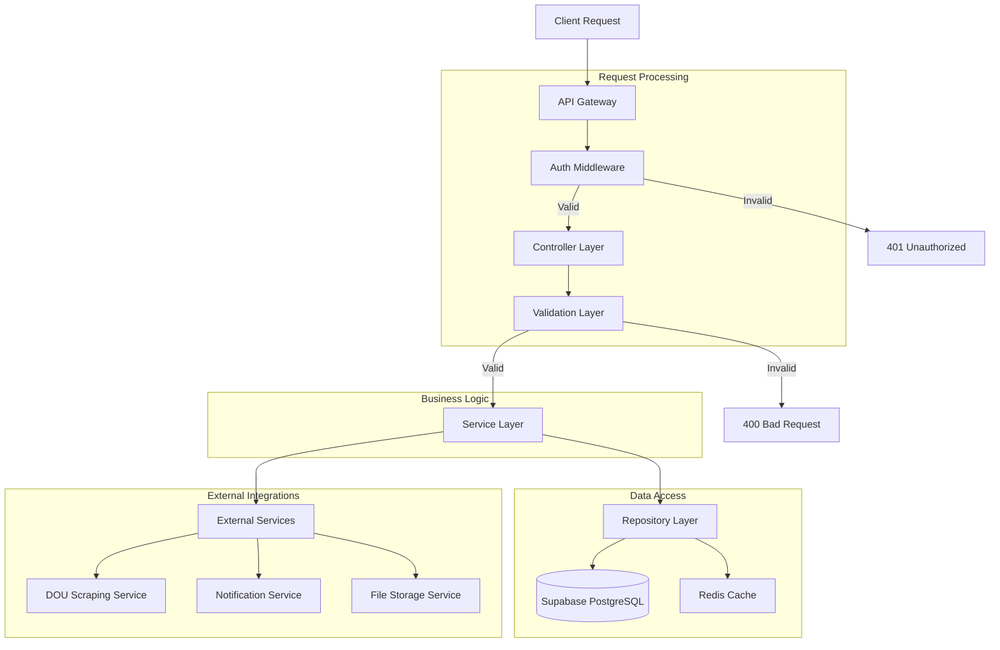
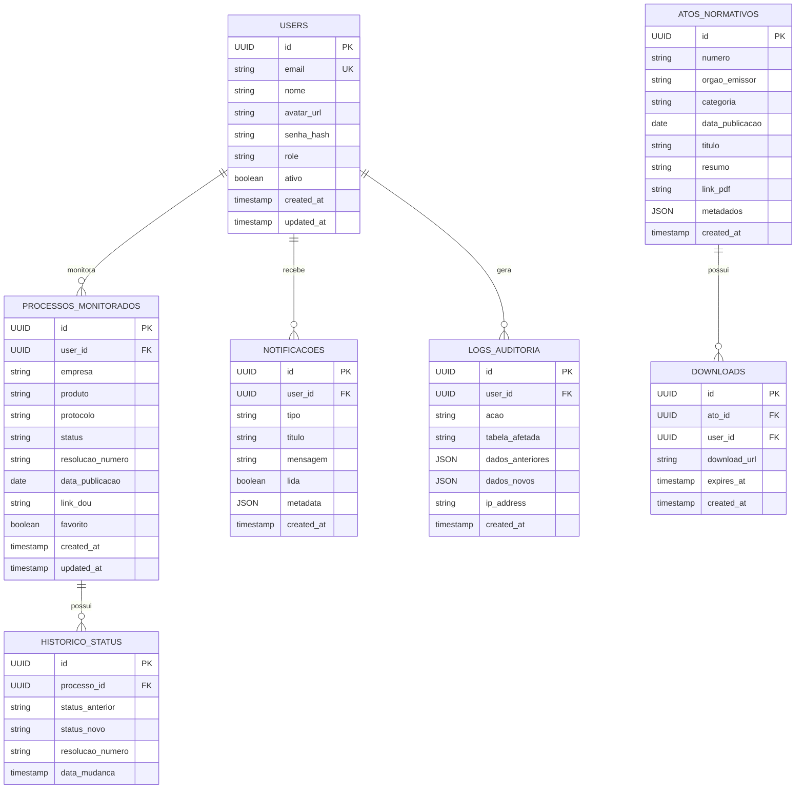

## 1. Architecture design



## 2. Technology Description

- **Frontend:** React@18 + TypeScript + TailwindCSS@3 + Vite
- **Mobile:** React Native@0.72 (iOS/Android)
- **Backend:** Node.js@20 + Express@4 + TypeScript
- **Database:** Supabase (PostgreSQL@15)
- **Cache:** Redis@7
- **Initialization Tool:** vite-init
- **Authentication:** Supabase Auth (Email/Password + Google OAuth)
- **File Storage:** Supabase Storage para PDFs
- **API Documentation:** Swagger/OpenAPI 3.0

## 3. Route definitions

| Route | Purpose |
|-------|---------|
| / | Dashboard principal com visão geral dos processos |
| /login | Página de login com Email/Google |
| /monitoramento | Tabela de acompanhamento de processos |
| /busca-atos | Motor de busca de atos normativos |
| /documentos/:id | Visualização de documentos PDF |
| /admin/usuarios | Gestão de usuários (admin only) |
| /admin/auditoria | Logs de auditoria (admin only) |
| /api/auth/* | Rotas de autenticação via Supabase |
| /api/processos/* | CRUD de processos monitorados |
| /api/atos/* | Busca e download de atos normativos |
| /api/notificacoes/* | Gerenciamento de notificações |

## 4. API definitions

### 4.1 Authentication API

```
POST /api/auth/login
```

Request:
| Param Name | Param Type | isRequired | Description |
|------------|------------|------------|-------------|
| email | string | true | Email do usuário |
| password | string | true | Senha com mínimo 8 caracteres |

Response:
| Param Name | Param Type | Description |
|------------|------------|-------------|
| access_token | string | JWT token para autenticação |
| refresh_token | string | Token para renovação |
| user | object | Dados do usuário logado |
| expires_in | number | Tempo de expiração em segundos |

Example:
```json
{
  "email": "usuario@exemplo.com",
  "password": "Senha@123"
}
```

### 4.2 Process Monitoring API

```
GET /api/processos
```

Request Headers:
```
Authorization: Bearer {access_token}
```

Query Parameters:
| Param Name | Param Type | isRequired | Description |
|------------|------------|------------|-------------|
| page | number | false | Página atual (default: 1) |
| limit | number | false | Itens por página (default: 20) |
| search | string | false | Busca por empresa/produto/protocolo |
| status | string | false | Filtrar por status (aprovado/reprovado/pendente) |

Response:
| Param Name | Param Type | Description |
|------------|------------|-------------|
| data | array | Lista de processos |
| total | number | Total de registros |
| page | number | Página atual |
| limit | number | Itens por página |

### 4.3 Normative Acts API

```
GET /api/atos
```

Request Headers:
```
Authorization: Bearer {access_token}
```

Query Parameters:
| Param Name | Param Type | isRequired | Description |
|------------|------------|------------|-------------|
| categoria | string | false | Categoria do ato (medicamentos/dispositivos/alimentos/cosmeticos) |
| data_inicio | string | false | Data inicial (YYYY-MM-DD) |
| data_fim | string | false | Data final (YYYY-MM-DD) |
| orgao | string | false | Órgão emissor |
| palavras_chave | string | false | Termos de busca |

```
POST /api/atos/:id/download
```

Response:
| Param Name | Param Type | Description |
|------------|------------|-------------|
| download_url | string | URL temporária para download do PDF |
| expires_at | string | Data de expiração da URL |

## 5. Server architecture diagram



## 6. Data model

### 6.1 Data model definition



### 6.2 Data Definition Language

**Users Table (usuarios)**
```sql
-- create table
CREATE TABLE usuarios (
    id UUID PRIMARY KEY DEFAULT gen_random_uuid(),
    email VARCHAR(255) UNIQUE NOT NULL,
    nome VARCHAR(255) NOT NULL,
    avatar_url TEXT,
    role VARCHAR(20) DEFAULT 'visualizador' CHECK (role IN ('visualizador', 'analista', 'admin')),
    ativo BOOLEAN DEFAULT true,
    created_at TIMESTAMP WITH TIME ZONE DEFAULT NOW(),
    updated_at TIMESTAMP WITH TIME ZONE DEFAULT NOW()
);

-- create indexes
CREATE INDEX idx_usuarios_email ON usuarios(email);
CREATE INDEX idx_usuarios_role ON usuarios(role);
```

**Processos Monitorados Table (processos_monitorados)**
```sql
-- create table
CREATE TABLE processos_monitorados (
    id UUID PRIMARY KEY DEFAULT gen_random_uuid(),
    user_id UUID NOT NULL REFERENCES usuarios(id) ON DELETE CASCADE,
    empresa VARCHAR(255) NOT NULL,
    produto VARCHAR(255) NOT NULL,
    protocolo VARCHAR(100) NOT NULL,
    status VARCHAR(50) DEFAULT 'pendente' CHECK (status IN ('pendente', 'aprovado', 'reprovado', 'com_pendencias')),
    resolucao_numero VARCHAR(100),
    data_publicacao DATE,
    link_dou TEXT,
    favorito BOOLEAN DEFAULT false,
    created_at TIMESTAMP WITH TIME ZONE DEFAULT NOW(),
    updated_at TIMESTAMP WITH TIME ZONE DEFAULT NOW()
);

-- create indexes
CREATE INDEX idx_processos_user_id ON processos_monitorados(user_id);
CREATE INDEX idx_processos_protocolo ON processos_monitorados(protocolo);
CREATE INDEX idx_processos_status ON processos_monitorados(status);
CREATE INDEX idx_processos_favorito ON processos_monitorados(favorito);
```

**Histórico Status Table (historico_status)**
```sql
-- create table
CREATE TABLE historico_status (
    id UUID PRIMARY KEY DEFAULT gen_random_uuid(),
    processo_id UUID NOT NULL REFERENCES processos_monitorados(id) ON DELETE CASCADE,
    status_anterior VARCHAR(50),
    status_novo VARCHAR(50) NOT NULL,
    resolucao_numero VARCHAR(100),
    data_mudanca TIMESTAMP WITH TIME ZONE DEFAULT NOW()
);

-- create indexes
CREATE INDEX idx_historico_processo_id ON historico_status(processo_id);
CREATE INDEX idx_historico_data_mudanca ON historico_status(data_mudanca DESC);
```

**Notificações Table (notificacoes)**
```sql
-- create table
CREATE TABLE notificacoes (
    id UUID PRIMARY KEY DEFAULT gen_random_uuid(),
    user_id UUID NOT NULL REFERENCES usuarios(id) ON DELETE CASCADE,
    tipo VARCHAR(50) NOT NULL CHECK (tipo IN ('status_mudanca', 'novo_ato', 'sistema')),
    titulo VARCHAR(255) NOT NULL,
    mensagem TEXT NOT NULL,
    lida BOOLEAN DEFAULT false,
    metadata JSONB,
    created_at TIMESTAMP WITH TIME ZONE DEFAULT NOW()
);

-- create indexes
CREATE INDEX idx_notificacoes_user_id ON notificacoes(user_id);
CREATE INDEX idx_notificacoes_lida ON notificacoes(lida);
CREATE INDEX idx_notificacoes_created_at ON notificacoes(created_at DESC);
```

**Atos Normativos Table (atos_normativos)**
```sql
-- create table
CREATE TABLE atos_normativos (
    id UUID PRIMARY KEY DEFAULT gen_random_uuid(),
    numero VARCHAR(100) NOT NULL,
    orgao_emissor VARCHAR(100) NOT NULL,
    categoria VARCHAR(50) CHECK (categoria IN ('medicamentos', 'dispositivos_medicos', 'alimentos', 'cosmeticos')),
    data_publicacao DATE NOT NULL,
    titulo TEXT NOT NULL,
    resumo TEXT,
    link_pdf TEXT,
    metadados JSONB,
    created_at TIMESTAMP WITH TIME ZONE DEFAULT NOW()
);

-- create indexes
CREATE INDEX idx_atos_numero ON atos_normativos(numero);
CREATE INDEX idx_atos_orgao ON atos_normativos(orgao_emissor);
CREATE INDEX idx_atos_categoria ON atos_normativos(categoria);
CREATE INDEX idx_atos_data_pub ON atos_normativos(data_publicacao DESC);
```

**Logs Auditoria Table (logs_auditoria)**
```sql
-- create table
CREATE TABLE logs_auditoria (
    id UUID PRIMARY KEY DEFAULT gen_random_uuid(),
    user_id UUID REFERENCES usuarios(id) ON DELETE SET NULL,
    acao VARCHAR(100) NOT NULL,
    tabela_afetada VARCHAR(100) NOT NULL,
    dados_anteriores JSONB,
    dados_novos JSONB,
    ip_address INET,
    user_agent TEXT,
    created_at TIMESTAMP WITH TIME ZONE DEFAULT NOW()
);

-- create indexes
CREATE INDEX idx_logs_user_id ON logs_auditoria(user_id);
CREATE INDEX idx_logs_acao ON logs_auditoria(acao);
CREATE INDEX idx_logs_tabela ON logs_auditoria(tabela_afetada);
CREATE INDEX idx_logs_created_at ON logs_auditoria(created_at DESC);
```

**Supabase Row Level Security (RLS) Policies**
```sql
-- Enable RLS on all tables
ALTER TABLE usuarios ENABLE ROW LEVEL SECURITY;
ALTER TABLE processos_monitorados ENABLE ROW LEVEL SECURITY;
ALTER TABLE notificacoes ENABLE ROW LEVEL SECURITY;
ALTER TABLE logs_auditoria ENABLE ROW LEVEL SECURITY;

-- Grant basic access to anon role
GRANT SELECT ON atos_normativos TO anon;

-- Grant full access to authenticated role
GRANT ALL PRIVILEGES ON ALL TABLES IN SCHEMA public TO authenticated;
GRANT ALL PRIVILEGES ON ALL SEQUENCES IN SCHEMA public TO authenticated;

-- RLS Policies for processos_monitorados
CREATE POLICY "Users can only see their own processes" ON processos_monitorados
    FOR ALL USING (auth.uid() = user_id);

-- RLS Policies for notificacoes  
CREATE POLICY "Users can only see their own notifications" ON notificacoes
    FOR ALL USING (auth.uid() = user_id);
```