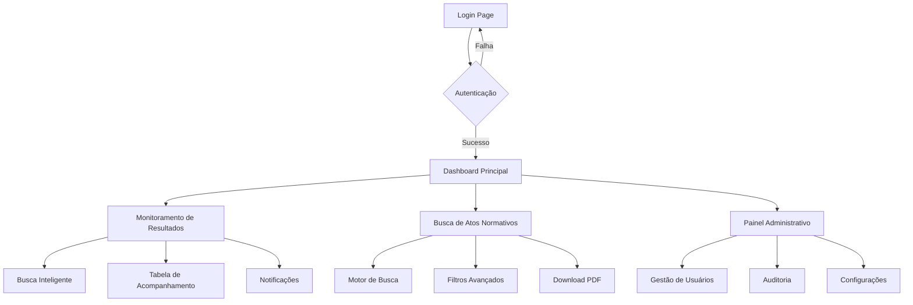

## 1. Product Overview

Sistema especializado para Analistas de Assuntos Regulatórios monitorarem informações da ANVISA publicadas no Diário Oficial da União (DOU). Otimiza o trabalho de consultoria regulatória através de busca inteligente, monitoramento automatizado e notificações em tempo real.

**Valor de Mercado:** Reduz tempo de pesquisa em 90% e garante conformidade regulatória para empresas do setor de saúde no Brasil.

## 2. Core Features

### 2.1 User Roles

| Role | Registration Method | Core Permissions |
|------|---------------------|------------------|
| Visualizador | Email/Google + senha forte | Visualizar resultados e atos normativos |
| Analista | Email/Google + senha forte + aprovação admin | CRUD completo na tabela de acompanhamento, exportação de dados |
| Admin | Email/Google + senha forte + cadastro manual | Gestão de usuários, auditoria de logs, configurações do sistema |

### 2.2 Feature Module

Nosso sistema de monitoramento ANVISA consiste nos seguintes módulos principais:

1. **Dashboard Principal**: Visão geral dos processos monitorados, notificações pendentes, atos normativos recentes
2. **Monitoramento de Resultados**: Busca inteligente por produto/protocolo, tabela de acompanhamento personalizada, histórico de alterações
3. **Busca de Atos Normativos**: Motor de busca especializado, filtros avançados, download de PDFs, sumários executivos
4. **Painel Administrativo**: Gestão de usuários, logs de auditoria, configurações do sistema

### 2.3 Page Details

| Page Name | Module Name | Feature description |
|-----------|-------------|---------------------|
| Dashboard Principal | Cards de Resumo | Exibir quantidade de processos ativos, notificações não lidas, últimas atualizações do DOU |
| Dashboard Principal | Widget de Notificações | Listar alertas de mudanças de status com link direto para o processo afetado |
| Dashboard Principal | Gráficos de Atividades | Mostrar tendências de aprovações/reprovações nos últimos 30 dias |
| Monitoramento de Resultados | Busca Inteligente | Permitir pesquisa por nome do produto, empresa, unidade fabril ou número de protocolo com auto-complete |
| Monitoramento de Resultados | Tabela de Acompanhamento | CRUD completo: adicionar, editar, remover processos; marcar favoritos; exportar para Excel/PDF |
| Monitoramento de Resultados | Integração DOU | Buscar automaticamente nos feeds do DOU, atualizar status dos processos, registrar histórico com timestamp |
| Monitoramento de Resultados | Sistema de Notificações | Enviar push notification/email quando houver mudança de status, permitir configuração de preferências |
| Busca de Atos Normativos | Motor de Busca | Busca full-text em atos normativos com suporte a sinônimos e termos técnicos |
| Busca de Atos Normativos | Filtros Avançados | Filtrar por data, tipo de ato, órgão emissor, categoria (medicamentos, dispositivos médicos, alimentos, cosméticos) |
| Busca de Atos Normativos | Visualização de Documentos | Exibir PDF com highlight dos termos pesquisados, extrair metadados (número do ato, data, órgão) |
| Busca de Atos Normativos | Sumário Executivo | Gerar resumo automático dos pontos principais do ato normativo usando IA |
| Busca de Atos Normativos | Compartilhamento | Criar links expiráveis para compartilhamento controlado de documentos |
| Painel Administrativo | Gestão de Usuários | Listar, aprovar, rejeitar, desativar usuários; alterar roles; visualizar logs de acesso |
| Painel Administrativo | Auditoria | Exibir logs completos de ações dos usuários com filtros por data, tipo de ação, usuário |
| Painel Administrativo | Configurações | Gerenciar parâmetros do sistema, tempos de busca, limites de requisições |
| Login | Autenticação | Validar Email/Senha, Login com Google, Recuperação de senha |
| Login | Recuperação de Senha | Enviar link por email com validade de 15 minutos |

## 3. Core Process

### Fluxo do Analista
1. Acesso à plataforma via Email/Google
2. Dashboard mostra processos monitorados e notificações pendentes
3. Adiciona novos processos à tabela de acompanhamento
4. Sistema busca automaticamente no DOU diariamente
5. Recebe notificações sobre mudanças de status
6. Acessa documentos originais via link direto
7. Exporta relatórios para apresentações

### Fluxo de Busca de Atos Normativos
1. Acessa módulo de busca de atos normativos
2. Aplica filtros por categoria, data, órgão emissor
3. Visualiza resultados com destaque dos termos pesquisados
4. Faz download do PDF ou gera sumário executivo
5. Compartilha documento via link expirável

### Fluxo Administrativo
1. Admin acessa painel administrativo
2. Aprova/rejeita solicitações de novos usuários
3. Monitora logs de auditoria
4. Configura parâmetros do sistema
5. Gera relatórios de uso da plataforma

## 4. User Interface Design

### 4.1 Design Style

**Cores Principais:**
- Primária: #1E3A8A (Azul ANVISA) - transmite confiança e profissionalismo
- Secundária: #059669 (Verde aprovação) - indica sucesso em processos
- Alerta: #DC2626 (Vermelho) - para reprovações e urgências
- Neutro: #6B7280 (Cinza) - para elementos secundários

**Elementos de UI:**
- Botões: Estilo arredondado com sombra suave, hover effects
- Fonte: Inter para títulos, Roboto para corpo do texto
- Tamanhos: 16px base, 14px para elementos secundários, 18-24px para títulos
- Layout: Card-based com grid responsivo, navegação lateral collapsible
- Ícones: Feather Icons para consistência visual

### 4.2 Page Design Overview

| Page Name | Module Name | UI Elements |
|-------------|---------------|---------------|
| Dashboard Principal | Cards de Resumo | Cards com ícones, números grandes em azul ANVISA, badges para status |
| Dashboard Principal | Widget de Notificações | Lista scrollable com badges vermelhos para não lidas, timestamp |
| Monitoramento de Resultados | Busca Inteligente | Input grande com ícone de busca, sugestões em dropdown, botão primário |
| Monitoramento de Resultados | Tabela de Acompanhamento | DataTable com sorting, pagination, actions menu, status badges |
| Busca de Atos Normativos | Filtros Avançados | Sidebar collapsible com checkboxes, date pickers, multi-select |
| Busca de Atos Normativos | Visualização de PDF | Embed PDF viewer com toolbar, highlight search terms em amarelo |

### 4.3 Responsiveness

**Desktop-first** com breakpoints:
- Desktop: 1200px+ (layout completo com sidebar)
- Tablet: 768px-1199px (sidebar collapsible, cards em 2 colunas)
- Mobile: <768px (menu hamburger, cards em 1 coluna, tabela scrollable horizontal)

**Otimizações touch:**
- Botões mínimo 44px para mobile
- Swipe gestures para navegação entre abas
- Touch-friendly dropdowns e selects
- Zoom permitido em documentos PDF